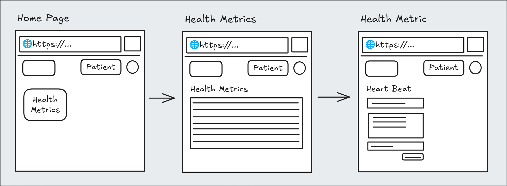
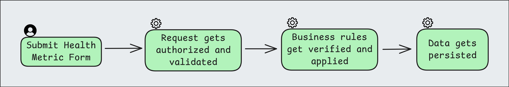
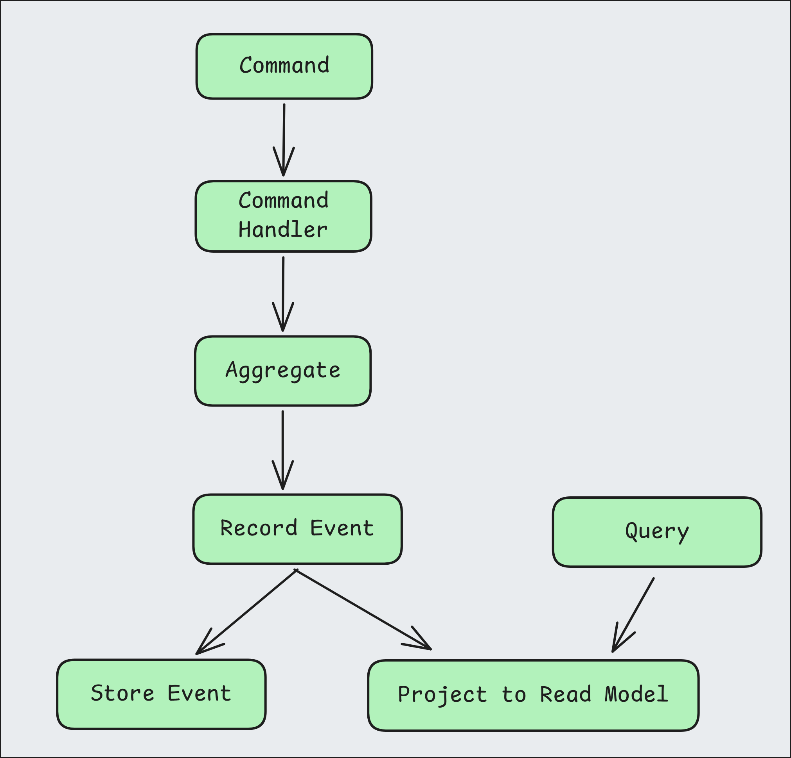

## Building Resilient PHP Applications

### _with an Event-Driven Mindset_

by Savio Resende

Longhorn PHP 2025

---

I'm **Savio Resende**

I'm a husband, a father of 2, and Software Engineer/Architect for 20 years.

@lotharthesavior

https://savioresende.com

---

## Topics

- Conventional systems
- Event Mindset
- Code

---

Part 1

## Conventional systems

---

### Initial Considerations

- Auditability and Traceability
- Decoupling and Flexibility
- Scalability and Resilience
- State Reconstruction and Testability

---

### Workflows

Every app relies on workflows to function.

It is moving applications from one state to another...

---

Part 2

## Event Mindset

---

### What it aims to solve?

The main goal of event sourcing is to capture and store every state change in a system as a sequence of immutable events.

---

### Designing with Event Orientation

Shift from imperative workflows to event-driven ones:

1. Identify events as the core units of change.
2. Model states as outcomes of event sequences.
3. Use pub/sub or message queues for loose coupling.

---

### Challenges in Event Mindset

- Eventual Consistency: States may lag; design for it.
- Debugging: Trace event flows across services.
- Idempotency: Handle duplicate events gracefully.

---

Part 3

## Code

---

### Tech Stack

- Laravel Framework
- Spatie Package: Event Sourcing
- Database: SQLite

---

### The Example App

- App to keep health metrics for patients.



---

### Let's explore one scenario

---

Health Metric registration



---

The Event Sourcing Flow



---

_api endpoint handler_

```php
<?php

// app/Http/Controllers/HealthProfileController.php

namespace App\Http\Controllers;

// ...

class HealthProfileController extends Controller
{

	// ...

	public function storeMetric(
		StoreMetricRequest $request,
		StoreHealthMetricCommandHandler $commandHandler,
		?Metric $metric = null,
	): RedirectResponse {
		$commandHandler->handle($request->getCommand());

		if ($metric) {
			return redirect()->route('health.metrics.index')->with('success', 'Metric updated successfully');
		}

		return redirect()->route('health.metrics.index')->with('success', 'Metric recorded successfully');
	}

	// ...

}

// ...
```

---

_the command_

```php
<?php

// app/Domains/HealthProfile/Commands/StoreHealthMetricCommand.php

namespace App\Domains\HealthProfile\Commands;

// ...

class StoreHealthMetricCommand implements CommandInterface
{
    public function __construct(
        public string $metricUuid,
        public string $profileUuid,
        public MetricType $type,
        public array $value,
        public ?string $notes = null,
        public ?string $photoUrl = null,
        public ?Carbon $timestamp = null,
    ) {}
}
```

---

_request preparing the command..._

```php
<?php

// app/Http/Requests/StoreMetricRequest.php

namespace App\Http\Requests;

// ...

class StoreMetricRequest extends FormRequest
{
	// ...

	public function getCommand(): StoreHealthMetricCommand
    {
        return new StoreHealthMetricCommand(
            metricUuid: $this->metric?->uuid ?? Str::uuid()->toString(),
            profileUuid: Context::get('profile'),
            type: MetricType::from($this->input('type')),
            value: $this->input('value'),
            notes: $this->input('notes'),
            photoUrl: $this->input('photo_url'),
            timestamp: $this->getTimestamp(),
        );
    }

    // ...
}

```

---

_the command handler_

```php
<?php

// app/Domains/HealthProfile/CommandHandlers/StoreHealthMetricCommandHandler.php

namespace App\Domains\HealthProfile\CommandHandlers;

// ...

class StoreHealthMetricCommandHandler implements CommandHandlerInterface
{
    public function handle(CommandInterface $command): void
    {
        if (!$command instanceof StoreHealthMetricCommand) {
            throw new InvalidArgumentException('Expected StoreHealthMetricCommand');
        }

        HealthProfileAggregate::retrieve($command->metricUuid)
            ->recordMetric(
                type: $command->type,
                value: $command->value,
                profileUuid: $command->profileUuid,
                notes: $command->notes,
                photoUrl: $command->photoUrl,
                timestamp: $command->timestamp,
            )
            ->persist();
    }
}
```

---

_the aggregate_

```php
<?php

// app/Domains/HealthProfile/Aggregates/HealthProfileAggregate.php

namespace App\Domains\HealthProfile\Aggregates;

// ...

class HealthProfileAggregate extends AggregateRoot
{
    public ?string $type = null;
    // ...

    public function recordMetric(
        MetricType $type,
        array $value,
        string $profileUuid,
        ?string $notes = null,
        ?string $photoUrl = null,
        ?Carbon $timestamp = null,
    ) {
        $this->recordThat(new MetricRecorded(
            type: $type->value,
            value: $value,
            profileUuid: $profileUuid,
            notes: $notes,
            photoUrl: $photoUrl,
            timestamp: $timestamp ?? now(),
        ));

        return $this;
    }

	// ...
}
```

---

_the projector_

```php
<?php

// app/Domains/HealthProfile/Projectors/HealthMetricsProjector.php

namespace App\Domains\HealthProfile\Projectors;

// ...

class HealthMetricsProjector extends Projector
{
    use ProjectsEvents;

    public function onMetricRecorded(MetricRecorded $event)
    {
        $metric = Metric::findByUuid($event->aggregateRootUuid());
        if ($metric === null) {
            $metric = new Metric([
                'uuid' => $event->aggregateRootUuid(),
            ]);
        }

        $metric->profile_uuid = $event->profileUuid;
        $metric->type = $event->type;
        $metric->value = $event->value;
        $metric->notes = $event->notes;
        $metric->photo_url = $event->photoUrl;
        $metric->timestamp = $event->timestamp ?? now();
        $metric->writeable()->save();
    }

	// ...
}
```

---

_the projection_

```php
<?php

// app/Domains/HealthProfile/Projections/Metric.php

namespace App\Domains\HealthProfile\Projections;

// ...

class Metric extends Projection
{
    use HasUuid;

    protected $primaryKey = 'uuid';

    protected $keyType = 'string';

	// ...
}
```

---

_the reactor_

```php
<?php

// app/Domains/HealthProfile/Reactors/DangerousHeartRate.php

namespace App\Domains\HealthProfile\Reactors;

// ...

class DangerousHeartRate extends Reactor implements ShouldQueue
{
    public function onMetricRecorded(MetricRecorded $event)
    {
        if ($event->type !== MetricType::HEART_RATE->value) {
            return;
        }

        $bpm = (int) Arr::get($event->value, 'bpm');
        if ($bpm === null) {
            return;
        }

        if ($bpm >= 40 && $bpm <= 120) {
            return;
        }

        Log::info('DangerousHeartRate Reactor triggered for MetricRecorded event.', [
            'profileId' => $event->profileUuid,
            'metricType' => $event->type,
            'value' => $event->value,
        ]);
    }
}
```

---

_the time machine (event query)_

```php
<?php

// app/Domains/HealthProfile/Queries/TimeMachineMetricsQuery.php

namespace App\Domains\HealthProfile\Queries;

// ...

class TimeMachineMetricsQuery
{
	// ...

    /**
     * Query the stored_events table with filters
     */
    protected function queryStoredEvents(): Collection
    {
        $query = StoredEvent::query()
            ->whereIn('event_class', [
                MetricRecorded::class,
                MetricDeleted::class,
            ])
            ->orderBy('created_at')
            ->orderBy('id');

		// ...

        return $query->get();
    }

    protected function replayEvents(Collection $events): Collection
    {
        Metric::truncate();

        $metrics = collect();

        DB::transaction(function () use ($events, &$metrics) {
            foreach ($events as $storedEvent) {
                $actualEvent = $storedEvent->toStoredEvent();
                $actualEvent->handle();

                $event = $actualEvent->event;
                $metricUuid = $storedEvent->aggregate_uuid;

                if ($event instanceof MetricRecorded) {
                    $metrics->put($metricUuid, [
                        'uuid' => $metricUuid,
                        'profile_uuid' => $event->profileUuid,
                        'type' => MetricType::from($event->type),
                        'value' => $event->value,
                        'notes' => $event->notes,
                        'photo_url' => $event->photoUrl,
                        'timestamp' => $event->timestamp,
                        'deleted' => false,
                        'deleted_at' => null,
                    ]);
                } elseif ($event instanceof MetricDeleted) {
                    if ($metrics->has($metricUuid)) {
                        $metric = $metrics->get($metricUuid);
                        $metric['deleted'] = true;
                        $metric['deleted_at'] = $storedEvent->timestamp;
                        $metrics->put($metricUuid, $metric);
                    }
                }
            }
        });

		// ...

        return $metrics->values();
    }
}
```

---

Let's see it happening!

---

Thank you!

@lotharthesavior

https://savioresende.com
